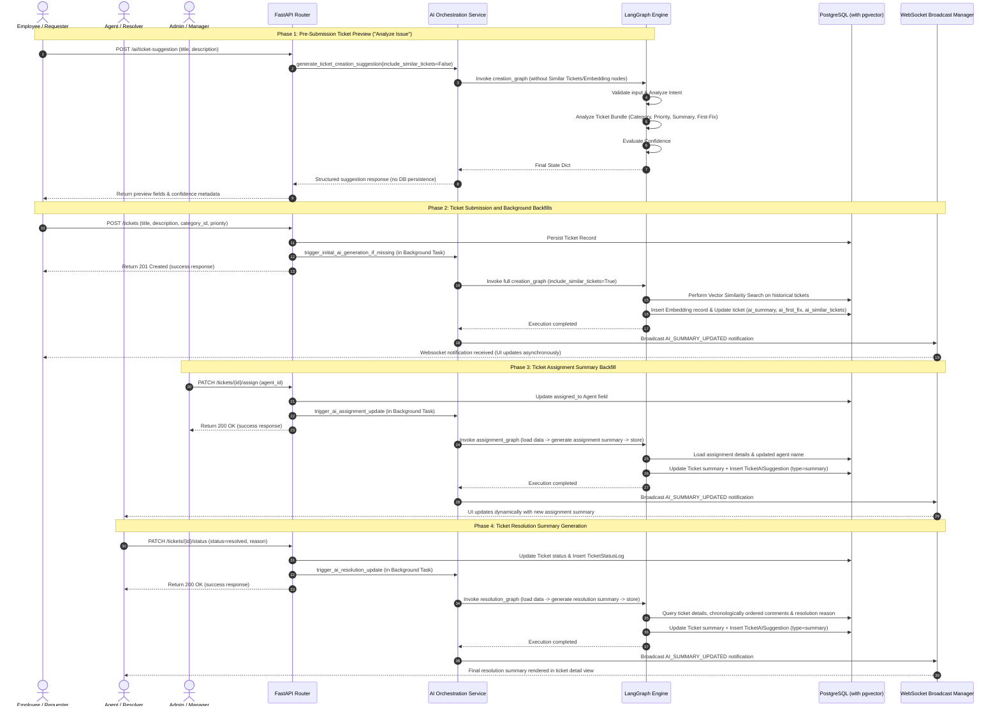
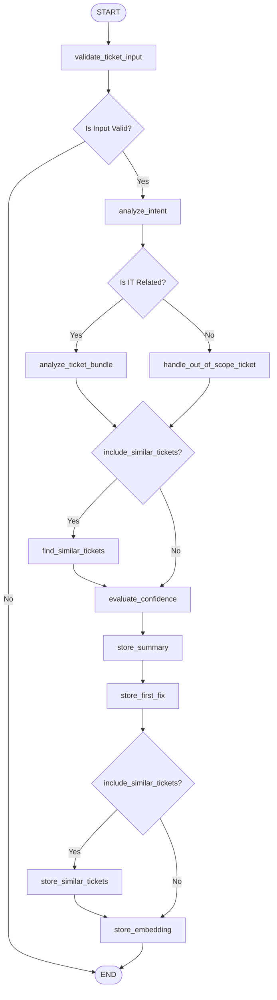
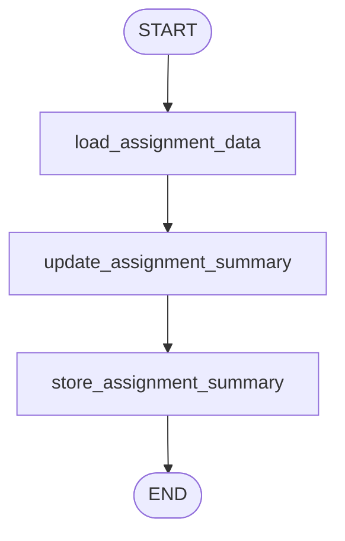
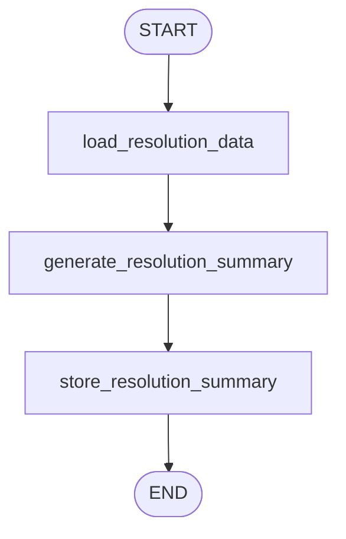

# Functional Requirements Document (FRD) — AI-Powered IT Helpdesk Assistant

## 1. Introduction

### 1.1 Objective
This document outlines the functional requirements, architectural designs, and workflow specifications for the AI-powered IT Helpdesk Assistant system. The system integrates an LLM-driven LangGraph orchestrator inside a FastAPI backend to offer real-time suggestions, status backfills, and summary insights for ticket lifecycles.

### 1.2 User Personas & Roles
- **Employee (Requester):** Submits tickets via a frontend UI. Can use the pre-submission preview ("Analyze Issue") to view AI-generated predictions of category, priority, and first-fix actions before submitting.
- **Agent (Resolver):** Handled by support staff. Resolves tickets, reviews details, views AI-generated insights, and adds comments.
- **Admin (Manager):** Full access to the system. Assigns tickets to agents, views performance statistics, and manages settings.

---

## 2. System Architecture & Boundaries

The system is built on a clean boundary pattern where FastAPI routers are separated from LangGraph workflow executions. 

```
┌──────────────────────────────────────────────────────────────┐
│                        FastAPI Router                        │
└──────────────────────────────┬───────────────────────────────┘
                               │ (Invokes Async Functions)
                               ▼
┌──────────────────────────────────────────────────────────────┐
│            ai_orchestration_service (The Seam)               │
└──────────────────────────────┬───────────────────────────────┘
                               │ (Compiles & Executes Graph)
                               ▼
┌──────────────────────────────────────────────────────────────┐
│                    LangGraph Workflow State                  │
└──────────────────────────────────────────────────────────────┘
```

- **Seam Boundary:** `app.ai.services.ai_orchestration_service` is the only interface through which FastAPI router endpoints interact with LangGraph code. Routers never import or run graph nodes or graph builders directly.
- **State Serialization:** Graph nodes retrieve and return updates as typed dictionaries matching `TicketCreationState`, `TicketAssignmentState`, and `TicketResolutionState`.
- **Database Context:** Nodes needing DB interaction are compiled using a request-scoped SQLAlchemy `Session` factory, ensuring that the graph compile instance is safe to run in concurrent greenlets.

---

## 3. Overall System Workflow

The diagram below depicts the end-to-end system sequence from when an employee triggers a pre-submission preview, creates a ticket, to when the ticket is assigned and resolved by an agent.



---

## 4. LangGraph Sub-Workflow Workflows

### 4.1 Ticket Creation Assistant Graph (`creation_graph.py`)
This workflow parses initial ticket metadata, performs intent classification, categorizes and prioritizes the ticket, suggests troubleshooting steps, searches similar tickets, evaluates confidence, and stores the results.



#### Detailed Creation Nodes Specification
1. **`validate_ticket_input` (Python Node):** Asserts title $\ge 5$ characters and description $\ge 15$ characters. Fails fast on invalid inputs to save LLM usage charges.
2. **`analyze_intent` (LLM Node):** Parses intent details to extract symptoms, affected systems, urgency, and whether the issue is IT-related.
3. **`analyze_ticket_bundle` (LLM Node):** Executed only for IT-related queries. Replaces three separate calls with a single merged LLM execution, returning category classification, priority level, initial summary, and first-fix suggestion.
4. **`handle_out_of_scope_ticket` (Python Node):** Triggered for non-IT tickets. Bypasses LLM calls and returns a static fallback object containing `"Not IT Support"` category, `"low"` priority, and an out-of-scope warning summary.
5. **`find_similar_tickets` (PGVector/Python Node):** Resolves embeddings and looks up similar historical tickets.
6. **`evaluate_confidence` (Python Node):** Computes confidence deterministically by weighting category confidence (35%), priority confidence (35%), and similarity match score (30%), minus a penalty (15% per error) if any prior step degraded or errored out.
7. **`store_summary` / `store_first_fix` / `store_similar_tickets` / `store_embedding` (DB Nodes):** Persists generated results onto the ticket record and embeds vector data for future lookups.

---

### 4.2 Ticket Assignment Graph (`assignment_graph.py`)
This graph is triggered asynchronously in the background when the assigned agent of a ticket changes.



#### Detailed Assignment Nodes Specification
1. **`load_assignment_data` (DB Node):** Resolves the assignee name, ticket descriptions, and the existing summary.
2. **`update_assignment_summary` (LLM Node):** Generates an updated summary that integrates the assignee change.
3. **`store_assignment_summary` (DB Node):** Commits the updated summary to the ticket and creates/updates a record of type `summary` in `ticket_ai_suggestions`.

---

### 4.3 Ticket Resolution Graph (`resolution_graph.py`)
This graph runs in the background when a ticket's status transitions to `resolved`.



#### Detailed Resolution Nodes Specification
1. **`load_resolution_data` (DB Node):** Queries chronological ticket comments (both public and internal), assignee name, original description, and the resolution reason from the status change log.
2. **`generate_resolution_summary` (LLM Node):** Reviews the complete ticket history, including comments and status logs, to compile a comprehensive, final resolution summary.
3. **`store_resolution_summary` (DB Node):** Commits the final resolution summary to the database and adds a corresponding suggestion entry.

---

## 5. Database Schema & Data Dictionary

The AI functionalities rely heavily on columns in the `tickets` table and two supplementary tables: `ticket_embeddings` (for vector searches) and `ticket_ai_suggestions` (for insights caching).

### 5.1 `tickets` Table Columns (AI-Specific)
| Column Name | Data Type | Nullable | Description |
| :--- | :--- | :--- | :--- |
| `ai_summary` | `TEXT` | True | The current summary text, updated throughout the ticket lifecycle. |
| `ai_first_fix` | `JSON` | True | Serialized dictionary of the first-fix steps, estimated time, and agent requirements. |
| `ai_similar_tickets` | `JSON` | True | Serialized JSON array containing references to similar historical tickets. |
| `last_ai_updated_at` | `TIMESTAMP` | True | Tracks the last time an AI-driven background generation ran. |

### 5.2 `ticket_embeddings` Table
Represents high-dimensional semantic search vectors generated for ticket titles and descriptions.

```sql
CREATE TABLE ticket_embeddings (
    id UUID PRIMARY KEY,
    ticket_id UUID NOT NULL REFERENCES tickets(id) ON DELETE CASCADE,
    source_text TEXT NOT NULL,
    embedding VECTOR(1536) NOT NULL, -- PGVector extension column (e.g. text-embedding-3-small)
    created_at TIMESTAMP WITH TIME ZONE NOT NULL,
    updated_at TIMESTAMP WITH TIME ZONE NOT NULL,
    CONSTRAINT uq_ticket_embeddings_ticket_id UNIQUE(ticket_id)
);
```

### 5.3 `ticket_ai_suggestions` Table
Caches the detailed summaries, root causes, suggested agent replies, and metadata contexts.

| Column Name | Data Type | Primary/Foreign Key | Description |
| :--- | :--- | :--- | :--- |
| `id` | `UUID` | Primary Key | Unique suggestion ID. |
| `ticket_id` | `UUID` | FK -> `tickets.id` | The ticket this suggestions belongs to. |
| `suggestion_type` | `Enum` | `SuggestionTypeEnum` | Type of suggestion (e.g., `summary`). |
| `suggested_category` | `VARCHAR(100)` | - | Category predicted by the AI. |
| `suggested_priority` | `VARCHAR(50)` | - | Priority predicted by the AI. |
| `first_fix` | `JSON` | - | Cached list of recommended troubleshooting steps. |
| `similar_tickets` | `JSON` | - | Cached similar tickets list. |
| `confidence_score` | `NUMERIC(4,2)` | - | Final confidence score calculated by the AI engine. |
| `summary` | `TEXT` | - | AI summary details. |
| `root_cause` | `TEXT` | - | Root cause identified by the resolution summary workflow. |
| `suggested_reply` | `TEXT` | - | Pre-formulated response suggested to the agent. |
| `detail_context` | `JSON` | - | Stores additional properties: actions already attempted, risk level, errors, and pending items. |

---

## 6. Non-Functional & Operational Requirements

### 6.1 Rate Limiting (Token Bucket / Sliding Window)
All orchestrations targeting external LLM providers must pass through a centralized rate limiter wrapper:
- **Limiter Instantiation:** Located in `app.ai.tools.rate_limiter.get_rate_limiter()`.
- **Pre-execution Check:** Prior to compile/execute steps on LangGraph, the orchestrator invokes `.acquire()` to prevent hitting API call thresholds. If the bucket is exhausted, requests are blocked until tokens refill.

### 6.2 Caching & LLM Fee Protection
- **View Caching:** When requesting summaries via `GET /ai/tickets/{id}/summary`, the endpoint queries the `ticket_ai_suggestions` table.
- **TTL Constraint:** If an entry exists and is within the cache TTL threshold, the cached database record is returned. The LLM is **never** invoked on subsequent detail views to save API charges.
- **Selective Similarity Search:** The vector search step (`find_similar_tickets`) and embedding node are disabled during the pre-submission phase (`include_similar_tickets=False`) and only executed once in the background after the ticket is created.

### 6.3 Graceful Degradation (FR-AI-005)
If an LLM invocation fails (network timeout, rate limit exceeded, provider down), the graph nodes must catch the error (`LLMInvocationError`) and recover:
- **Defaults Fallback:** Return reasonable static values (e.g., default active category, `"medium"` priority, empty lists for first-fix steps, and original ticket title/details for summary).
- **Error Tracking:** Append the failure reason to the state's `errors` list.
- **Observability:** Set the `degraded = True` flag on output models and lower the confidence score (minus 15% per error penalty), ensuring the UI is aware that fallback defaults were served.

### 6.4 Compliance & Labeling (FR-AI-006)
- **UI Labeling:** The frontend MUST flag all fields derived from AI processes (such as category suggestions, priority predictions, summaries, first-fix steps) with an visible label (e.g., an icon, badge, or text saying `"AI-Generated"`).
- **Confidence Flagging:** If the calculated `confidence_score` is below the configured threshold (e.g., `0.50`), the UI must highlight the values with a warning banner indicating that manual triage is recommended.
